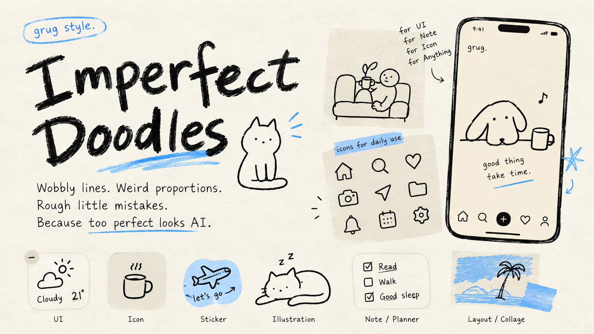
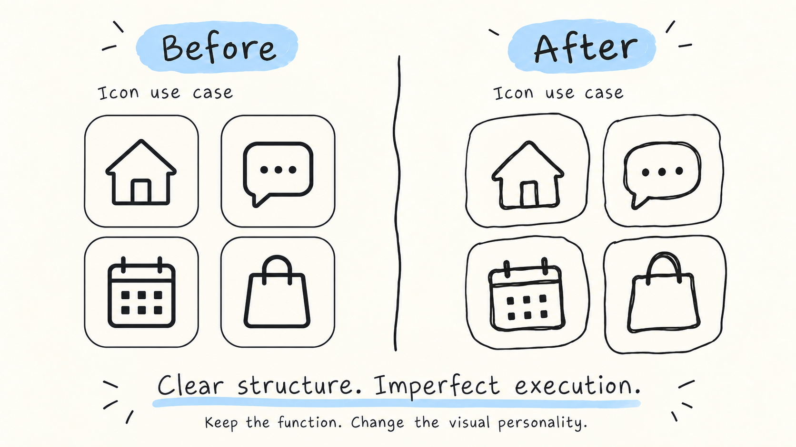
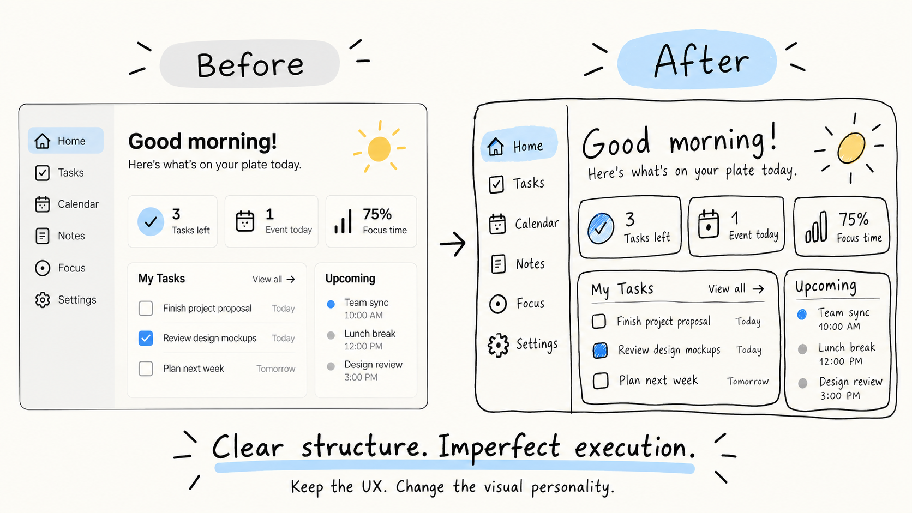

# Imperfect Doodles

> **Too correct is the most AI-looking choice.**

**Imperfect Doodles** is a reusable visual Skill for creating relaxed, intentionally imperfect, human-drawn interfaces, icons, illustrations, wallpapers, posters, and characters.

The core idea is:

> **Relaxed feeling + clear structure + imperfect execution.**

The style is not about making things messy. It is about preserving the tiny mistakes that make a visual feel like a person actually drew it: wobbly lines, strange proportions, uneven repetition, naive geometry, and small human errors.



## Version

**v1.0** — first public release.

## What it is for

Use Imperfect Doodles when you want a visual to feel:

- relaxed
- handmade
- naive
- warm
- playful
- slightly awkward
- less polished
- less AI-generated

Typical use cases:

- UI / widgets
- everyday icons
- empty states
- wallpapers
- posters
- characters
- illustrations
- cards
- visual experiments

## Icon Before / After

A simple everyday icon use case: keep the function, change the visual personality.



The rule is simple:

- **Before:** clean, standard, geometric icons
- **After:** same meaning, but redrawn with relaxed handmade lines
- keep icons monochrome by default
- let lines wobble slightly
- allow small proportion mistakes
- keep recognizability and usability clear

## UI Before / After

A full-interface example: keep the UX structure, change the visual personality.



The transformation rule:

- keep the original information architecture and content hierarchy
- keep navigation, cards, and task structure recognizable
- redraw borders, icons, dividers, and selected typography with relaxed hand-drawn lines
- allow small spacing and proportion irregularities
- keep the overall interface calm, readable, and usable

> **Keep the UX. Change the visual personality.**

## Trigger examples

中文：

```text
把这套图标改成 Imperfect Doodles 风格
```

English:

```text
Make these icons Imperfect Doodles.
```

Shortcut:

```text
#ImperfectDoodles
```

## Core principle

This Skill does **not** mean:

- random rotation
- chaotic layouts
- excessive paper texture
- unreadable handwriting
- filling every empty area
- deliberately ugly design

It means:

- relaxed feeling comes first
- structure stays intentional
- drawing stays imperfect
- repeated objects are not identical
- geometry is recognizable but not mathematically perfect
- imperfection is controlled, not random

## Repository structure

```text
imperfect-doodles/
├── SKILL.md
├── README.md
├── LICENSE
├── assets/
│   ├── social-preview.png
│   ├── icon-before-after.png
│   ├── ui-before-after.png
│   └── wallpaper-example.png
└── examples/
    └── prompts.md
```

## Inspiration

The visual thinking is inspired by relaxed, intentionally imperfect hand-drawn product languages such as **grug**.

This Skill does **not** instruct the model to copy a specific product. Instead, it extracts reusable visual principles:

- looseness
- human error
- awkward proportion
- naive geometry
- restrained color
- generous empty space

## Usage

直接用自然语言调用即可：

```text
把这个页面改成松弛手绘风
```

```text
Turn this UI into a relaxed hand-drawn style.
```

也可以使用快捷触发：

```text
#ImperfectDoodles
```

## Philosophy

The goal is not to make AI draw badly.

The goal is to preserve the kinds of small mistakes that make visual work feel relaxed and human.

**Don't make it messy. Make it human.**

## License

MIT License.
